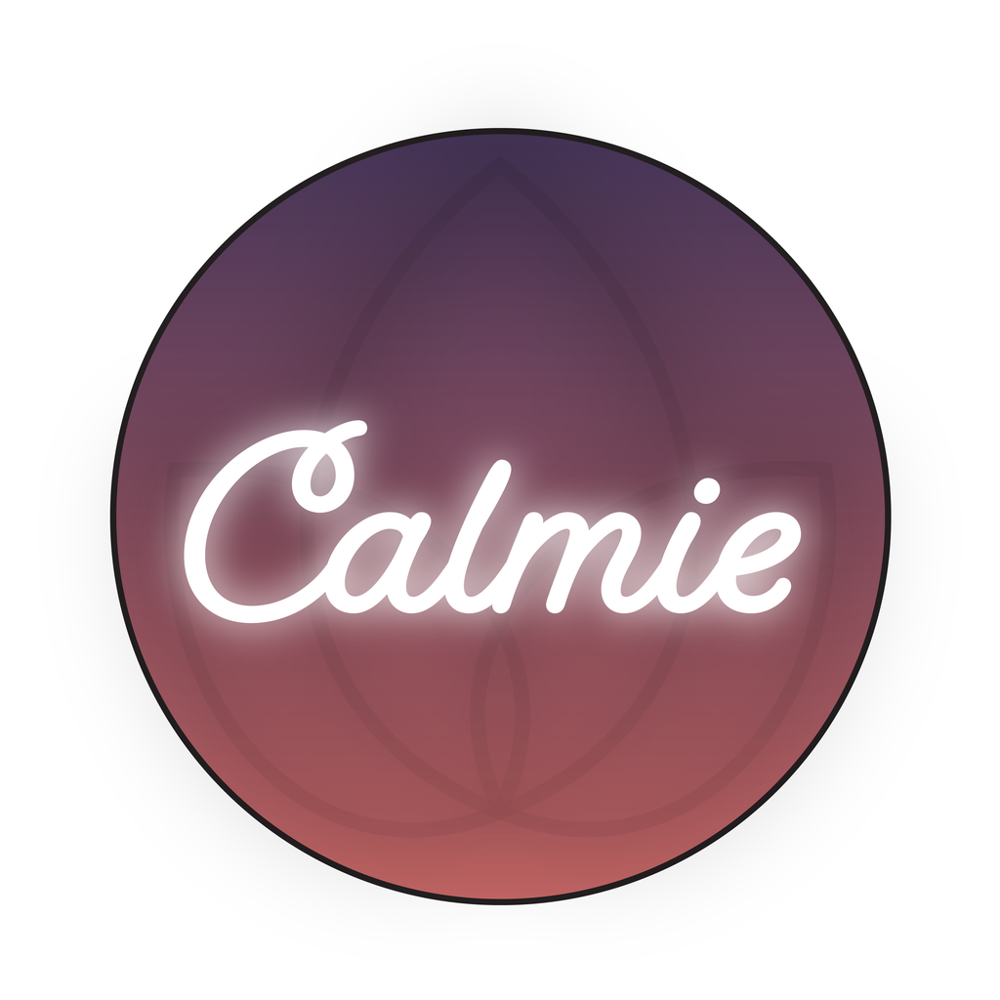

# Calmie — Meditation Timer for iOS

A clean, distraction-free meditation app for iPhone. Built for anyone who wants a simple way to meditate daily, track their progress, and build a consistent mindfulness habit.

---

## Features

- **Meditation timer** — 1 to 60 minutes, with ambient music and calming word affirmations
- **Session history & stats** — streak days, total sessions, total minutes meditated
- **Box Breathing** — guided 4-4-4-4 breathing exercise with animated circle
- **Daily reminder** — set a time, get a notification every day
- **Pause / Resume / Stop** — full playback control during a session
- **Background audio** — music keeps playing when the screen is locked

---

## Built With

- Swift & SwiftUI
- CoreData — local session persistence
- AVFoundation — audio playback
- UserNotifications — daily reminders
- CoreHaptics / UIKit haptics — tactile feedback

## Requirements

- iOS 16+
- Xcode 14+

---

## Screenshots

---

## License

Personal project. All rights reserved.
